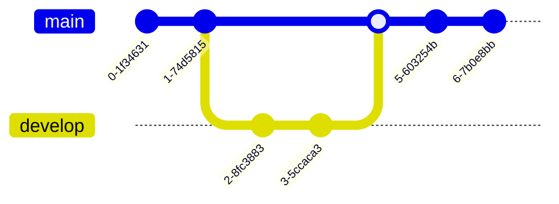

This post tests the Mermaid diagram integration with various diagram types to ensure proper rendering and theme compatibility.

## Flowchart


## Sequence Diagram


## Class Diagram


## State Diagram


## Entity Relationship Diagram


## User Journey


## Gantt Chart


## Pie Chart


## Git Graph



## Complex Flowchart with Styling


## Error Handling Test

This should show an error state:

```mermaid
graph TD
    A[Invalid syntax
    B --> C
    INVALID_COMMAND
```

## Theme Integration

The diagrams should automatically adapt to the current theme (light/dark) and use the theme colors for better integration with the overall design.

## Responsive Design

All diagrams should be responsive and work well on mobile devices, with proper scaling and overflow handling.
